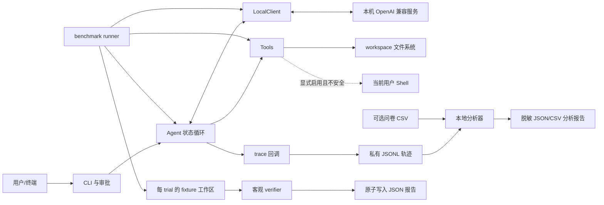
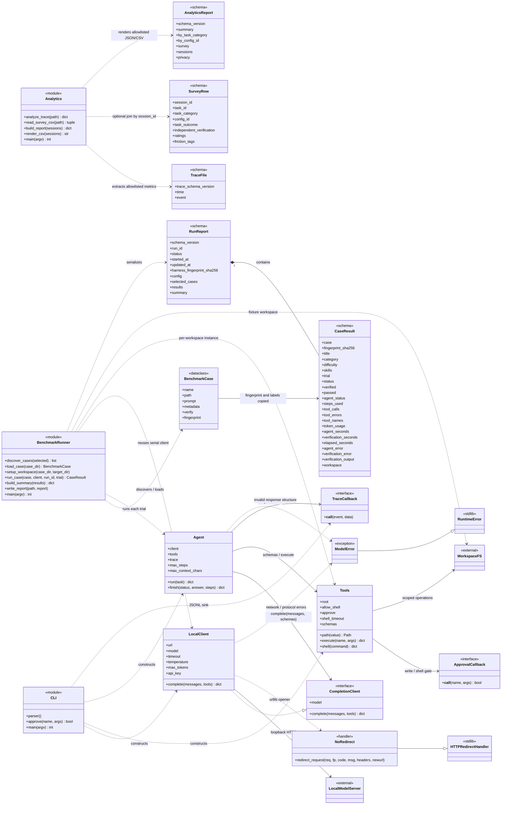
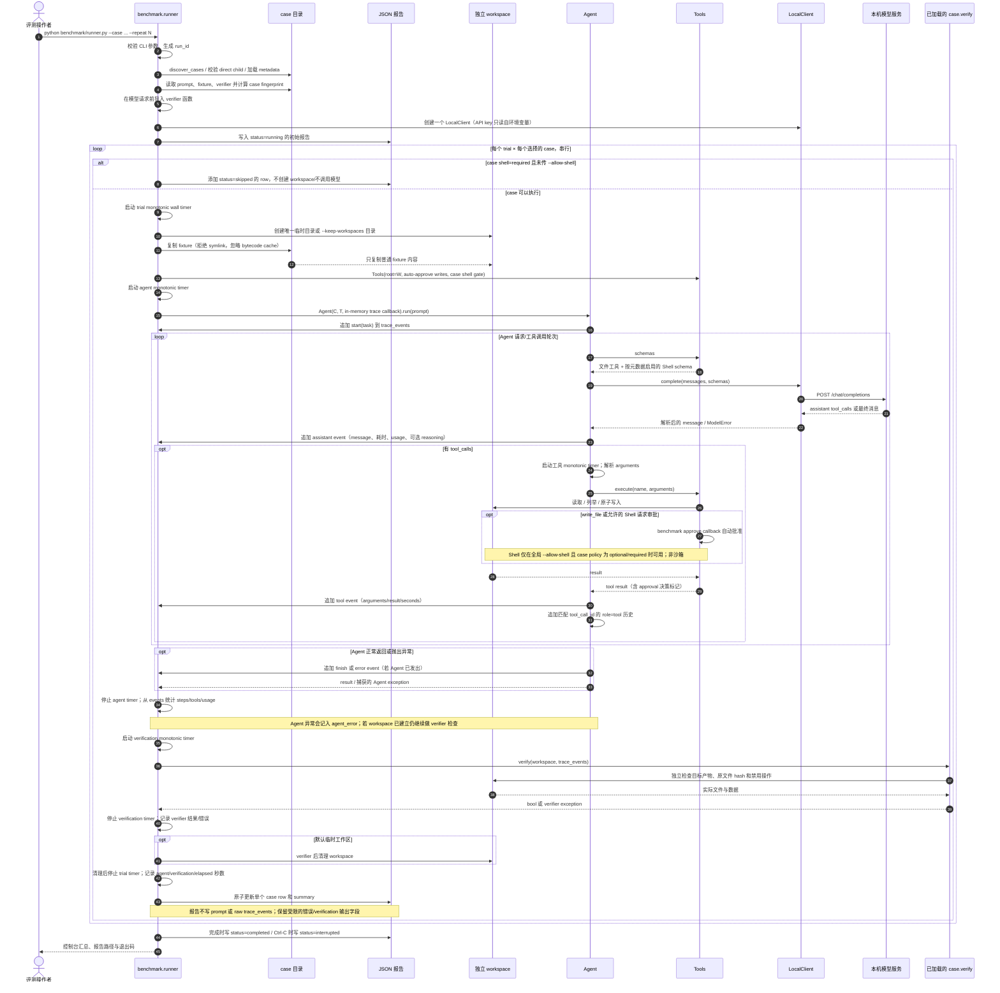
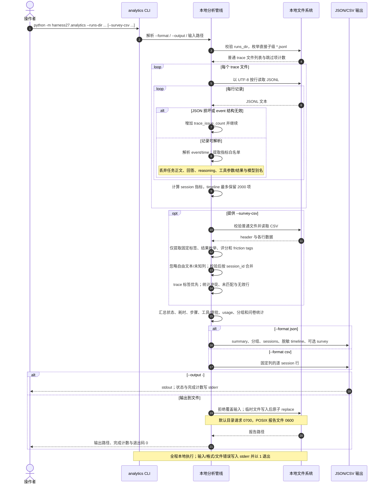

# Harness27 系统设计文档

## 1. 设计目标与非目标

### 1.1 目标

1. 在不下载模型和不依赖云端 SDK 的前提下，通过本机 OpenAI 兼容服务调用已部署的 27B 模型。
2. 给模型一个受限、可审计的文件工作区，并用原生 tool-call 协议完成多轮“模型—工具—模型”任务。
3. 对真实任务建立可独立验证、可重复运行的评测入口，区分产物正确性、Agent 流程完成度和基础设施故障。
4. 默认采用保守权限：文件写入和 Shell 要批准；benchmark 将文件写入审批限制在独立工作区，Shell 需显式启用。

### 1.2 非目标与明确边界

- 不负责模型训练、权重获取、权重载入、GPU 管理、量化、模型参数量验证、tokenizer/chat template/tool parser 配置。
- 不声称 prompt 指令、路径检查或 Shell 命令白名单构成 OS 沙箱。
- 不为小型 smoke suite 提供行业排名或可泛化的单一能力总分。
- 不做模型结果缓存或请求自动重试；后者可能重复已发生的工具副作用。
- 不支持从 JSONL 轨迹自动恢复中断的 Agent 运行。

## 2. 系统上下文与组件



| 模块 | 文件 | 单一职责 | 重要约束 |
|---|---|---|---|
| CLI | `harness27/cli.py` | 参数解析、审批回调、轨迹存储、返回码。 | 交互中精确输入 `yes` 才批准；非 TTY 自动拒绝。 |
| 本地分析器 | `harness27/analytics.py` | 汇总 CLI JSONL 轨迹，可选关联问卷 CSV，写出脱敏 JSON/CSV 报告。 | 只在本机运行；使用字段白名单；不会读取 benchmark 报告或发送网络请求。 |
| 模型客户端 | `harness27/client.py` | 发送 OpenAI Chat Completions 请求、解析响应、统一连接错误。 | 仅回环 IP；忽略代理；拒绝重定向；不回显 HTTP 错误正文。 |
| Agent | `harness27/agent.py` | 管理 messages、轮数与字符预算、验证 tool-call 外层结构、执行工具并把结果交回模型。 | 每轮最多 16 个调用；工具调用按序执行；无自动重试。 |
| 工具层 | `harness27/tools.py` | 构造工具 schema，执行 workspace 文件操作及可选 Shell。 | 文件访问不是 OS 沙箱；Shell 是当前用户权限下的 `shell=True` 命令。 |
| 评测运行器 | `benchmark/runner.py` | 发现并验证用例，建立 fixture workspace，调用 Agent/verifier，保存报告。 | concurrency=1；用例名白名单式检查；工作区不复用、不清空旧固定目录。 |
| 用例 | `benchmark/cases/case_*/` | 固定输入、任务说明、能力标签和独立 verifier。 | verifier 不以模型自述判分，测试和输入基准应有固定 hash。 |

## 2.1 类图：运行时对象与数据契约

下图中的 `CLI`、`BenchmarkRunner`、`Analytics` 是 Python **模块**，不是实例化的类；`RunReport`、`CaseResult`、`AnalyticsReport`、`TraceFile` 和 `SurveyRow` 表示 JSON/JSONL/CSV 数据 schema，不是 Python dataclass。`Agent`、`LocalClient`、`Tools`、`BenchmarkCase` 和异常类是代码中的实际类。`CompletionClient` 是 Agent 所需的 duck-typed 接口，当前未定义 Python `Protocol`/ABC；`ApprovalCallback` / `TraceCallback` 也是函数回调契约。类图关系用于说明依赖方向。



## 2.2 时序图：交互式 harness 完整调用

图中包含初始化、预算/协议失败、最终回答、工具循环和审批分支。CLI 为每次运行创建 versioned JSONL 轨迹（每条 event 有 `trace_schema_version=1` 和时间戳）；可选的 `--task-id` / `--task-category` / `--config-id` 仅写入 `start` 元数据，且必须是受限短标签。`Tools` 只对 `write_file` / `shell` 请求审批；读取和目录列举不询问。图中的 JSONL participant 是 CLI 注入的 `trace` callback；Python API 可以换成其他 callback。终止分支会立即从 `Agent.run` 返回，不会继续下一轮。原始 JSONL 含任务和工具数据，不能当作可公开的指标文件。

```mermaid
sequenceDiagram
    autonumber
    actor U as 用户
    participant CLI as harness27.cli
    participant A as Agent
    participant T as Tools
    participant AP as CLI approve callback
    participant C as LocalClient
    participant M as 本机模型服务
    participant FS as workspace 文件系统
    participant SH as Shell 子进程
    participant LOG as JSONL trace

    U->>CLI: python -m harness27 task --model ...
    CLI->>CLI: 解析参数、校验预算与可选短标签
    CLI->>C: LocalClient(base_url, model, ...)
    CLI->>T: Tools(workspace, allow_shell, approve)
    CLI->>LOG: 创建 0600 JSONL；目录请求 0700
    CLI->>A: Agent(client, tools, trace, ...).run(task)
    A->>LOG: start(schema=1, time, task, model, optional labels)

    loop 每个模型轮次，直到 Agent 返回或耗尽 max_steps
        A->>A: JSON 序列化 messages 并检查 max_context_chars
        alt 字符预算超限
            A->>LOG: finish(context_limit, ...)
            A-->>CLI: result(context_limit)
            CLI-->>U: 打印预算提示，退出码 2
        else 预算足够
            A->>T: 读取 tools.schemas
            T-->>A: 当前允许的 function schemas
            A->>C: complete(messages, schemas)
            C->>M: POST /v1/chat/completions
            alt HTTP、连接或 Chat Completions 结构错误
                M-->>C: error / invalid response
                C-->>A: raise ModelError
                A->>LOG: error(type, message)
                A-->>CLI: exception
                CLI-->>U: 输出错误并以 1 退出
            else assistant message 已解析
                M-->>C: choices[0].message + usage
                C-->>A: 校验后的 assistant message
                A->>A: 校验 tool_calls 类型、数量、function 字段和轮内唯一 ID
                alt tool_calls 外层结构无效
                    A->>LOG: error(ModelError, ...)
                    A-->>CLI: exception
                    CLI-->>U: 输出协议错误并以 1 退出
                else tool_calls 结构有效
                    A->>LOG: assistant(message, monotonic seconds, time, finish_reason, usage, optional reasoning)
                    alt 无 tool_calls，finish_reason=length
                        A->>LOG: finish(length_truncated, partial answer)
                        A-->>CLI: result(length_truncated)
                        CLI-->>U: 打印部分答案，退出码 2
                    else 无 tool_calls，正文为空
                        A->>LOG: error(ModelError, empty answer)
                        A-->>CLI: exception
                        CLI-->>U: 输出协议错误并以 1 退出
                    else 无 tool_calls，存在最终正文
                        A->>LOG: finish(completed, answer)
                        A-->>CLI: result(completed)
                        CLI-->>U: 打印答案，退出码 0
                    else 存在 tool_calls
                        loop 按返回顺序处理每个调用，最多 16 个
                            A->>A: 启动 monotonic 工具计时；JSON 解析 arguments
                            alt arguments 不是合法 JSON 文本
                                A->>A: 构造 ok=false 参数错误结果，不调用 Tools
                            else arguments 是合法 JSON
                                A->>T: execute(name, args)
                                T->>T: 校验工具名、必需字段和字符串类型
                                alt list_files / read_file
                                    T->>T: 解析路径并检查 workspace 边界
                                    T->>FS: 列举或读取 workspace
                                    FS-->>T: 目录项 / 文件内容 / 工具错误
                                else write_file
                                    T->>T: 解析 workspace 路径并校验 UTF-8 字节预算
                                    T->>AP: approve(write_file, args)
                                    AP-->>U: 显示完整参数并请求 yes
                                    U-->>AP: yes / 其他输入 / EOF
                                    AP-->>T: true / false
                                    T->>T: 设置 approval=approved / denied
                                    alt 批准
                                        T->>T: 再解析目标路径
                                        T->>FS: 同目录临时文件写入后 os.replace
                                        FS-->>T: bytes_written / 文件系统错误
                                    else 拒绝
                                        T-->>T: 返回用户拒绝结果
                                    end
                                else shell（仅启用时出现在 schema）
                                    T->>AP: approve(shell, args)
                                    AP-->>U: 显示命令并请求 yes
                                    U-->>AP: yes / 其他输入 / EOF
                                    AP-->>T: true / false
                                    T->>T: 设置 approval=approved / denied
                                    alt 批准
                                        T->>SH: shell=True，cwd=workspace，带超时
                                        SH-->>T: returncode + 截断输出
                                    else 拒绝
                                        T-->>T: 返回用户拒绝结果
                                    end
                                else 未启用工具 / 参数字段或类型错误
                                    T-->>T: 返回 ok=false 工具错误
                                end
                            end
                            A->>LOG: tool(name, arguments, result + approval marker, monotonic seconds)
                            A->>A: 追加匹配 tool_call_id 的 role=tool 消息
                        end
                        Note over A,M: 下一轮将完整历史重新发给模型；没有自动重试
                    end
                end
            end
        end
    end
    opt 所有 max_steps 均已消耗且尚无终止结果
        A->>LOG: finish(step_limit, ...)
        A-->>CLI: result(step_limit)
        CLI-->>U: 打印未完成提示，退出码 2
    end
    Note over A,CLI: context_limit、协议错误和最终答案均在轮次内立即返回，不进入 step_limit 分支
```



### 时序图补充说明

- 模型每轮可能返回多个工具调用；Agent 先校验整批调用结构，再按顺序执行工具。arguments JSON 解析失败不会调用 Tools，而是生成工具错误消息交回模型。
- `write_file` 的 workspace 路径会在审批前校验，字节上限也在审批前检查；批准后执行前会重新解析路径。Shell 不受文件工具路径限制。
- 工具结果即使是 `ok=false` 也会作为 `role=tool` 消息交回模型，让它可以修正；工具错误本身不代表 Agent 协议异常。`write_file` / `shell` 的 tool result 会带 `approved`、`denied` 或 `not_requested` 决策标记。
- `assistant.seconds` 以 monotonic clock 计模型请求时间；`tool.seconds` 覆盖参数解析、人工审批等待（若有）和工具执行。每条 JSONL event 的 `time` 是 UTC wall-clock 时间。
- 上图为 CLI 路径。库调用者注入的审批和 trace callbacks 可以有不同实现；`Tools` 的默认审批则拒绝写入和 Shell。原始 JSONL 仍包含 task、模型内容、工具参数/结果及可能的 reasoning，必须按敏感数据管理。

## 2.3 时序图：benchmark 单个 trial 与报告生命周期

Runner 在创建模型请求前加载所有 case/verifier 并计算指纹；一批 case 共用 LocalClient，但每个实际执行的 case/trial 都创建新的 fixture workspace、Tools 和仅驻内存的 `trace_events`。该事件列表包含 verifier 所需的原始 task、assistant、tool 数据及可能的 reasoning，不作为 JSON 报告写出；报告保存状态、计数、计时、verifier 结果及受限诊断字段。所有 trial 串行执行。



错误分支：若工作区创建失败，Runner 返回 `error` row，不调用 verifier；若 Agent 出现连接/协议异常，已有 workspace 仍会交给 verifier，以免丢掉已经正确生成的产物；verifier 异常则作为 `error`，不计入能力成功率。JSON 报告每个 trial 后原子替换，因此中断时已完成的 row 会保留。

## 2.4 时序图：本地轨迹分析与问卷关联

`harness27.analytics` 是独立的本地后处理流程，不调用模型、不读取 benchmark 报告，也不发网络请求。输入是 CLI JSONL；可选问卷 CSV 用 `session_id` 关联。JSON 与 CSV 导出都由固定字段白名单构建，原始轨迹和问卷应仍按敏感资料管理。



### 时序图补充说明

- 分析器仅扫描 `runs_dir` 的直接子级 `*.jsonl`，跳过 symlink/非普通文件；不会递归，也不会读取 benchmark 报告。无法解析的 JSONL 行计入数据质量问题。
- `session_id` 通常取 trace 文件名；不符合安全格式的文件名会转换为短 hash。事件时间线有 2000 项上限，截断状态会显式记录。
- `duration_seconds` 根据首末可解析 trace 时间戳计算；`assistant_seconds` 与 `tool_seconds` 来自 trace 中 monotonic 计时。工具耗时包含参数解析、审批等待（如有）与执行。
- JSON 包含汇总、分组和脱敏 timeline；CSV 是逐 session 白名单列，不含 JSON 的整体 summary。问卷开放文本和未知 CSV 列不会进入任一报告；问卷标签冲突时保留 trace 标签并只记录冲突数。
- 报告不导出任务正文、模型回答、工具参数/结果、文件路径、reasoning、模型别名或自由文本。原始 JSONL 本身仍可能包含这些敏感内容，报告输出到 stdout 时也须保护接收端。

## 3. Agent 请求/响应协议

### 3.1 本地客户端

`LocalClient` 接受 `http://` 或 `https://` 且 hostname 是 IP loopback 的 URL。拒绝 URL 用户名/密码、query、fragment、域名及远程 IP。URL 被规范为：

```text
{base_url.rstrip("/")}/chat/completions
```

请求体包含：

```json
{
  "model": "服务端注册名",
  "messages": [],
  "temperature": 0.2,
  "max_tokens": 2048,
  "stream": false,
  "tools": [],
  "tool_choice": "auto"
}
```

API key 若存在，放在 `Authorization: Bearer ...` header。请求使用标准库 `urllib` 和空 proxy handler，不读取 HTTP(S)_PROXY 环境配置。HTTP 重定向由 handler 拒绝。错误正文不打印，以免服务返回体携带 prompt 或敏感字段。

客户端接受 `choices[0].message`，要求 `role=assistant`，`content` 为字符串或 null；会从 choice/data 顶层补入 `finish_reason`/`usage`（仅当 message 中没有相应值）。模型提供方必须能返回 native `assistant.tool_calls` 及后续 `role=tool` / `tool_call_id` 兼容结构。远端服务的模型身份、量化或工具解析器不会被客户端验证。

### 3.2 多轮 Agent 状态循环

初始消息为 `system`（固定安全/行为约束）和 `user`（任务）。每轮操作概述：

1. 将完整消息列表 `json.dumps(..., ensure_ascii=False)` 并计算字符数；超 `max_context_chars` 时不发请求，返回 `context_limit`。
2. 调用 `client.complete(messages, tools.schemas)`，记录模型耗时。
3. 把缺失/空 `tool_calls` 视为空列表；要求其为列表且最多 16 个。每个调用必须是 `type=function`，有非空、轮内唯一 id，function 名是字符串，arguments 是 JSON 文本字符串。
4. 向会话历史只保留标准 `assistant` role/content/tool_calls 字段。推理服务的 `reasoning_content`、usage 和 finish reason 不进入下一轮 messages；它们会按存在与否写入 trace。
5. 若无工具调用且 finish reason 是 `length`，返回 `length_truncated`；无工具调用但没有正文则按协议异常抛出；否则将正文作为最终回答并返回 `completed`。
6. 若有工具调用，按响应顺序逐个 JSON 解析参数并执行。无效 JSON 会得到工具错误结果，不中断后续同批调用。每个调用的工具返回值序列化后作为匹配的 `role=tool` 消息追加。
7. 达到 max_steps 后返回 `step_limit`，不会自动补发一次“最终总结”请求。

工具结果/文件内容作为 messages 交给模型。固定系统提示将其标记为不可信数据、禁止越权并要求实际 tool confirmation 后才能声明成功；这属于模型行为指引，不是安全隔离。

### 3.3 预算和计数语义

- `max_steps` 是模型响应轮数，不是总工具调用数；总工具调用上限还受每轮 16 次限制。
- Agent 在每个模型请求前检查 message 历史的 JSON 字符数；tool schema 不计入这个历史字符数，字符数也不是 tokenizer token 数。
- `max_tokens` 传给每次模型请求；不同 serving 实现可能有自身限制。
- `list_files` 每次至多列 200 个直接子项；返回集合排序，但目录超过上限时被截掉的尾项受文件系统迭代顺序影响。
- `read_file` 读至多 32 KiB + 1 字节以判断截断，返回前 32 KiB UTF-8 解码（非法序列替换）。
- `write_file` 限制编码后内容不超过 32 KiB。
- Shell 默认不进入 tool schema；开启后执行超时默认 30 秒，捕获合并 stdout/stderr，最多回传 32 KiB。临时输出文件可在系统限额之外写大，必须由外部 quota 控制。

## 4. 工具权限与安全模型

### 4.1 审批接口

`Tools` 接收 `approve(name, args)` callback。无 callback 时默认拒绝写入与 Shell。主 CLI 的 callback 显示工具及完整参数，非交互拒绝，交互精确输入 `yes` 才批准。库调用方可替换 callback，但需自行实现授权。

Benchmark 为重复、可比较执行使用自动批准 callback；文件写工具由路径和大小策略限制到新建 workspace。只有用户传 `--allow-shell` 且用例 metadata 设为 `optional`/`required`，才将 Shell 暴露给模型；此时命令同样自动批准，因此必须由外部隔离层保护。

### 4.2 文件访问边界

文件路径从 workspace root 解析并解析符号链接，再检查仍位于 root 内；`.git` 和 `.harness27` 路径组成部分被拒绝。读取仅文件工具 root 下文件，不提供任意主机路径接口。覆写操作先写同目录临时文件，再用 `os.replace` 替换目标，避免沿着已有硬链接修改链接外部内容。

这并未使用 `openat`/目录文件描述符锁定整条访问链，因此无法抵御所有 TOCTOU 并发攻击。符号链接检查不能约束已有硬链接内容，特殊设备和其他文件系统情形也不是完整威胁覆盖。执行宿主可信、workspace 隔离是设计前提。

### 4.3 Shell 边界

Shell 使用 `subprocess.Popen(..., shell=True)`，当前 OS 用户权限、环境变量和网络都可达。它不受 workspace path validator 限制。POSIX 使用独立进程组并在超时后 kill group；不保证清除自行 detach 的进程。命令输出截断仅约束返回数据，不约束命令写盘或创建进程。故 Shell 从来不应被描述为沙箱。

### 4.4 网络、输入和审计

HTTP client 约束仅保护 Harness 的模型请求路径；本机推理服务可能自行联网，Shell 也可能联网。断网需配置主机/容器网络策略。task、模型 response、工具参数和工具结果都是敏感/不可信数据。现在 trace 中包含 `tool.arguments` 以便验证负约束；这些参数也会落入主 CLI JSONL，需要保护日志权限。没有通过 prompt engineering 替代人工授权或 OS 隔离。

## 5. CLI 状态和可观察性

CLI 创建 `.harness27/runs/<UTC>-<id>.jsonl`，以 JSONL 逐事件 flush；每条记录包含 trace schema version 和时间戳，主要 event 为 `start`、`assistant`、`tool`、`finish`、`error`。`start` 可携带经过校验的 task/category/config 标签；assistant event 可包含 reasoning、finish reason 和 usage；tool event 包含 step、call id、工具名、解析后的参数（或无效 JSON 原文）、结果、耗时和显式审批决策。日志以 POSIX 0600 创建，数据保留和清理由使用方负责。

`harness27/analytics.py` 本地消费 CLI JSONL，按白名单生成脱敏的 session 指标、事件时间线和可选问卷汇总；不导出任务文本、回答、工具参数/结果、模型别名或 reasoning，也不联网。它不能从 trace 判断 task correctness；需要独立 verifier。报告默认放在被 Git 忽略的 `.harness27/analytics/`。使用方法见[本地运行记录与过程分析工具](ANALYTICS.md)。

Agent 的结束状态和进程退出码不等价于独立任务正确性：`completed` 只表示模型产生了最终文本，不是验收结果。Agent 状态是 `completed`、`context_limit`、`length_truncated`、`step_limit`；客户端/Agent异常走 CLI error path。CLI exit code 详见[使用说明](USER_GUIDE.md#6-运行预算和结束状态)。

## 6. Benchmark 设计

### 6.1 文件组织和元数据

```text
benchmark/
  runner.py
  cases/
    case_<id>/
      case.json
      prompt.txt
      verify.py
      fixture/...
```

`case.json` 必须提供：

- `title`：非空说明。
- `category`：用于分组。
- `difficulty`：`easy` / `medium` / `hard`。
- `skills`：非空且不重复的字符串列表；允许跨 case 重叠。
- `shell`：`disabled` / `optional` / `required`。

可选 `user_story`、`acceptance_criteria`、`out_of_scope` 用于保留完整业务需求和验收边界；库存补货、软件包顺序计划、支持工单分派、会议室分配，以及制造质检、物料齐套、批次追溯、OEE、维护、换型、来料、标签、报废、停机、包装与产能 case 都将每条 AC 映射到确定性 verifier 与测试。Runner 不解释这些字段，但整个 `case.json` 已包含在 case fingerprint 中，变更会标记为新的评测版本。

Runner 仅接受 `cases/` 的直接 `case_*` 子目录，拒绝遍历路径和 case 目录、入口 prompt/verifier/fixture root 的 symlink。fixture 内 symlink 和特殊文件也被拒绝。加载 verifier 时在任何模型/工具执行前导入所有用例 verifier，并把当前 Python 函数对象用于本次运行，避免简单的“先改 verifier 文件”作弊路径；这不是保护本机不可信 Shell 的隔离机制。

### 6.2 一次 trial 的数据流

1. 创建新临时 workspace 或 `--keep-workspaces` 下的独立持久 workspace，将 fixture 复制进去。忽略 `__pycache__` 和 bytecode；不执行 `rmtree` 旧固定目录。
2. 使用同一个 LocalClient 调用 Agent；每个 trial 新建 Tools 根目录和 trace event list。benchmark 所有文件写入自动批准。
3. Shell 仅按全局 opt-in + case metadata 门控；`required` 未授权时产生 `skipped` row，不发模型请求。
4. Agent 收尾或异常后，调用该 case 的 `verify(workspace_dir, trace_events)`；verifier 返回真/假形成客观产物判定。setup/agent/verifier 错误单独标记。
5. 汇总模型轮数、工具名/工具错误、服务返回 token usage 与计时；清理临时目录，或在保留模式下记录 workspace 路径。
6. JSON 报告每个 case 写入后原子更新，所以中断后保留已有 trial；用户中断时报告状态为 `interrupted`。

Runner 自动创建唯一 run id 和 workspace，不覆写已存在的固定 benchmark workspace。`--report` 路径则通过原子 replace 更新（包括已存在的目标文件）。

### 6.3 评分语义

- `passed`/`failed` 是 verifier 可评测的任务结果，进入 `success_rate` 分母。
- `error` 是连接/协议/工作区/verifier 异常，不进入能力成功率分母。
- `skipped` 是无模型请求的任务，如 required Shell 没有授权，也不进入分母。
- `agent_completed` 统计 Agent 以 `completed` 收尾；`completion_rate` 的分母是实际执行数（排除 skipped），因此与 verifier 通过率分开。
- 若 verifier 通过但 Agent 状态不是 completed，仍记 verifier pass，同时 `agent_completed` 不增加；这分离“工作产物有效”和“对话流程完整”。
- Token usage 累加每轮 assistant usage；如果服务不提供 usage，数值为 0/未观察到，不是真实零用量。
- `mean_elapsed_seconds` 为 Runner 测得的墙钟执行时间，不是 GPU kernel latency；skills 计数会重叠。

### 6.4 指纹与可复现性

每个 case 的 SHA-256 指纹由 case metadata、prompt、verifier 和 fixture 文件/目录相对路径及内容组成；临时 Python bytecode 不计入。Harness 指纹覆盖 `benchmark/runner.py`、`harness27/agent.py`、`client.py`、`tools.py`。报告还记录 Python 版本及客户端可见参数。

这些 fingerprint 帮助识别本仓库评测材料和执行逻辑的变更，但不会验证 API 后面的模型 checkpoint、量化、serving engine、tokenizer 或 parser。报告使用 model alias/base URL；实验比较仍需人工保存推理服务构建和权重元信息。

## 7. 失败分类与诊断原则

单个总分不足以定位问题。建议至少从以下角度检查报告和 `--keep-workspaces` 产物：

- **模型能力**：抽取/分析/计算结果是否错，错误能否通过改写提示或增加结构化输出约束纠正。
- **工具调用协议**：无 native tool call、参数非 JSON、字段/类型不符、重复 ID、未启用工具调用。
- **工具使用策略**：工具调用过多、路径错误、写错位置、对敏感内容的访问尝试、过度调用 Shell。
- **执行预算**：`step_limit`、`context_limit`、`length_truncated`，以及任务是否应拆分或调高真实模型上下文预算。
- **Serving/infra**：HTTP 错误、超时、usage 缺失、模型名/parser/chat template 配错。
- **验收设计**：verifier 是否独立、稳定、覆盖提示词里的否定要求、是否误判语法无关但语义正确的产物。

任何对 prompt、fixture、metadata、verifier 或工具实现的修改都会改变指纹。改变后应把分数当成新评测版本，而非同一版本的直接提升/退步。

## 8. 测试层次和已知空白

自动化测试分为：

1. Harness 单元测试：FakeClient 多轮协议、预算、工具参数、路径逃逸、文件覆盖保护和 Shell 超时。
2. 本机 loopback HTTP test server：Chat Completions 请求/响应、工具选项、重定向阻止。
3. Benchmark verifier 单测：正负产物、源文件 hash、负约束 trace、CSV 金额、库存补货数量、安装计划依赖/版本、工单 SLA/时区、会议室容量/设备/时间冲突、质检规格限值、BOM 短缺、批次追溯、OEE、校准/维护、换型、来料、标签、报废、停机、包装和产能计算边界。
4. Benchmark runner 假模型测试：成功/失败判分、Shell gating、目录隔离、错误分类、报告和权限。

完整运行：

```bash
python -m unittest discover -s tests -v
```

已知限制：case 数少、部分 case 简单、difficulty 未校准、无真实 27B 端到端测量、无模型 checkpoint 证明、无内置容器沙箱和无可复现 sampling seed。后续若用于生产决策，应扩充真实多步骤任务及边界变体、保存部署元数据、建立独立 hold-out 集，并在外部隔离运行 Shell。不要将现有 smoke-suite 成绩误读为普遍能力声明。
