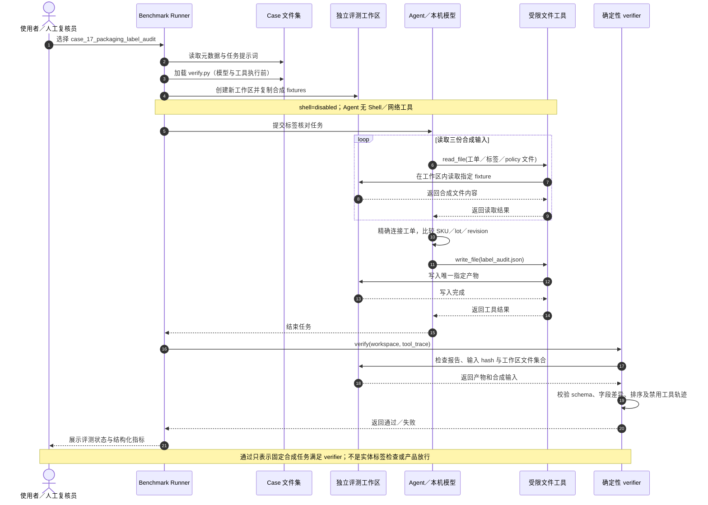

# case_17_packaging_label_audit：核对成品标签与工单主数据

[← 返回使用场景总览](../USE_CASES.md) · [能力评测手册](../BENCHMARK_GUIDE.md)

**类别：** `quality_operations`　 **难度：** `medium`　 **Shell：** 禁用

> 本页描述的是合成数据上的 review-only benchmark 任务。产物仅供人工复核；不代表实际部署或 27B 模型评测结果，也不构成设备操作、质量放行或生产指令。

## 用户故事

> 作为包装质量检验员，我想把合成打印标签上的 SKU、成品批次和版本与工单主数据逐项比对，以便包装人员可以人工发现错标风险，而不把不匹配标签贴到产品或托盘上。

## 业务背景与输入

将合成打印标签记录与对应工单主数据逐项核对，暴露 SKU、批次或版本差异，供包装质量人员人工复核错标风险。

| 合成输入 | 内容与用途 |
|---|---|
| [`label_policy.json`](../../benchmark/cases/case_17_packaging_label_audit/fixture/label_policy.json) | 差异字段输出顺序。 |
| [`printed_labels.csv`](../../benchmark/cases/case_17_packaging_label_audit/fixture/printed_labels.csv) | 合成标签 ID、工单 ID、打印 SKU/批次/版本。 |
| [`work_orders.csv`](../../benchmark/cases/case_17_packaging_label_audit/fixture/work_orders.csv) | 对应工单中的成品 SKU、批次和标签版本主数据。 |

## 端到端时序图

以下图示说明从启动 case 到得到审核结果的本地评测流程。Agent 在独立工作区处理合成文件；Shell 与网络工具均不可用。



模型请求由使用者配置的本机兼容服务承接；图中的网络禁用指 Agent 工具权限，不表示 Runner 无需本地模型接口。Verifier 在执行前已载入，执行后只检查评测工作区和工具轨迹。

## 计算规则与结果契约

- 先按 `work_order_id` 连接；未知工单标记 `unknown_work_order`，差异字段仅包含工单 ID。
- 已知工单逐字段精确比较 SKU、lot 和 label revision；一致为 `match`，否则为 `mismatch`。
- 差异字段按 policy 顺序列出；每个标签恰好一条，按 `label_id` 排序。

- **唯一允许新增的文件：** `label_audit.json`（JSON 数组；每项仅包含 `label_id`、`work_order_id`、`status`、`mismatch_fields`）。
- **完整验收准则：**
  - **AC-01：** 每个打印标签恰好输出一条结果，字段仅为 label_id、work_order_id、status、mismatch_fields。
  - **AC-02：** 已知工单的 SKU、lot 和 label revision 与主数据精确匹配时为 match；不匹配时逐字段列出差异。
  - **AC-03：** 未找到 work_order_id 时 status 为 unknown_work_order，mismatch_fields 只含 work_order_id。
  - **AC-04：** 标签按 label_id 升序，差异字段按 policy 顺序输出，所有标签均不得遗漏或重复。
  - **AC-05：** 只新增 label_audit.json；不打印/作废标签、不修改工单、不调用 Shell 或外部系统。

## 人工复核重点

- 字符串必须精确匹配，不做大小写折叠、模糊匹配或自动纠正。
- 标签记录找不到工单时不得猜测主数据，按规定返回 unknown 状态。
- 报告不是实体标签检查、标签打印/作废、产品隔离或质量放行。

## 范围外与安全边界

- 自动打印、贴附或作废实体标签
- 放行或隔离产品
- 修改 SKU、lot 或版本主数据
- 连接真实 MES、WMS 或打印机
- 只处理此用例目录中的合成 fixture；只在 Runner 创建的独立评测工作区生成指定 JSON。
- `shell` 为 `disabled`；Agent 不调用 Shell/网络工具，也不访问 PLC、打印机、MES、ERP、WMS、QMS、CMMS、APS 或其他外部系统。
- verifier 检查 fixture 完整性、输出 schema/内容、工作区文件边界及禁用工具轨迹；通过只表示通过此固定合成任务的自动校验。

## 复现与验证

离线运行新增用例的 verifier 单测（不连接模型服务）：

```bash
python -m unittest tests.test_benchmark.BenchmarkVerificationTests.test_cases_12_to_21_manufacturing_verifiers_are_deterministic_and_shell_free -v
```

如需通过 Runner 向已配置的本机兼容服务发起此 case，可将 `local-27b` 替换为服务实际注册的模型名：

```bash
python benchmark/runner.py --model local-27b --case case_17_packaging_label_audit
```

上面的命令是使用说明，不表示本项目已对真实 27B 模型运行或获得任何成功率；本 case 的 Shell 权限始终禁用。

## 实现文件

- [用例元数据](../../benchmark/cases/case_17_packaging_label_audit/case.json)
- [模型任务提示词](../../benchmark/cases/case_17_packaging_label_audit/prompt.txt)
- [确定性 verifier](../../benchmark/cases/case_17_packaging_label_audit/verify.py)
